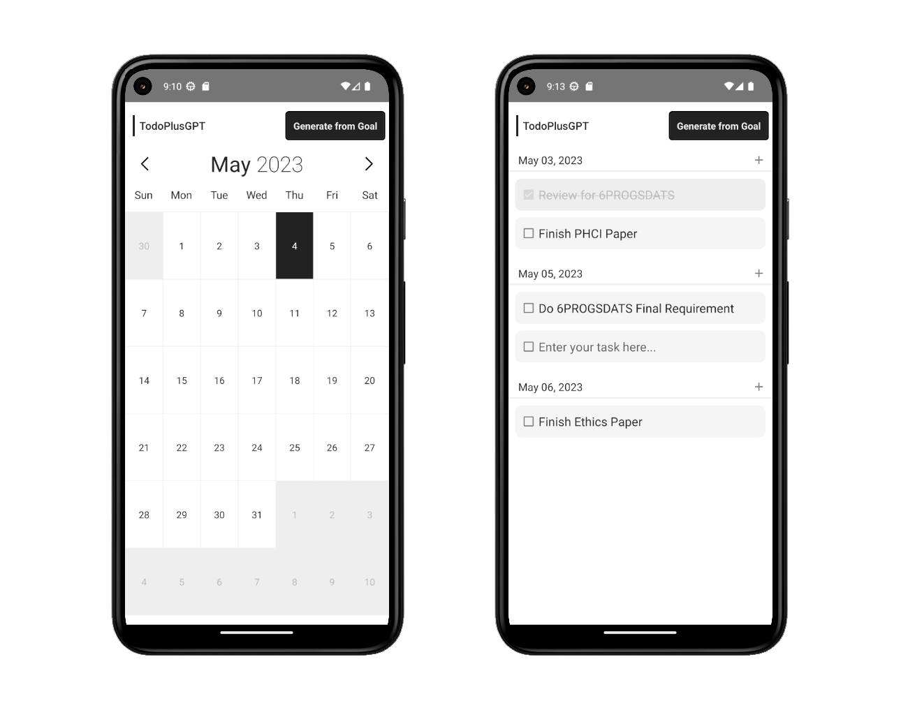
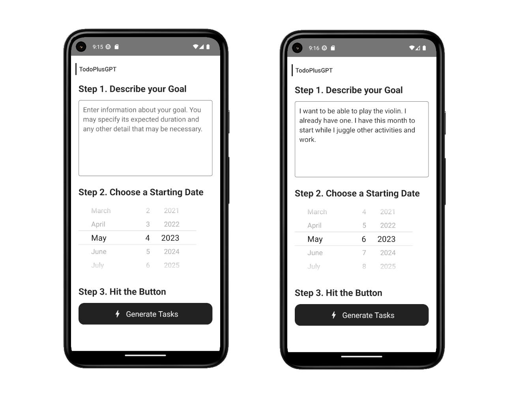

# TodoPlusGPT &middot;  
## Overview
This is a project for one of our classes. It allows you to schedule a task you want to accomplish. The twist is that you can  This version is mostly a barebones prototype with a decent but incomplete user-interface. I don't have much intention of finishing it but it is open to improvements.

## Screenshots
Provided are screenshots of what the application looks like.

## Commands
I'm not entirely sure how to set everything up since I last worked with this.
- `npx react-native start`
- `npx react-native start --reset-cache`